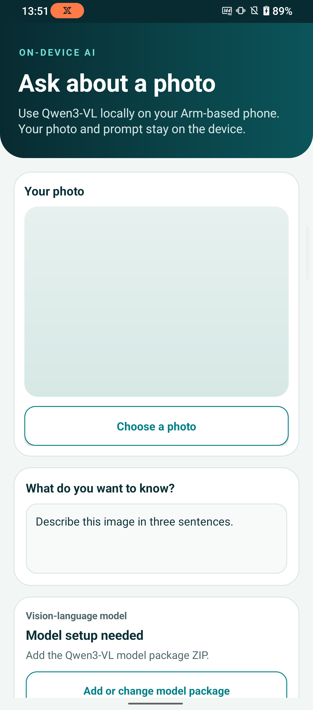
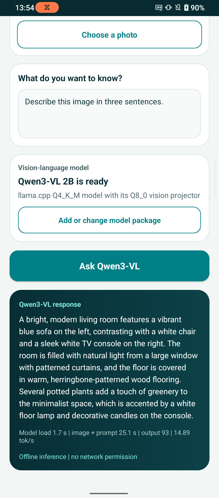

# Vision Chat Android application

This example application accompanies the [Arm Learning Path for running an
optimized vision-language model from the Arm AI Portal on
Android](https://learn.arm.com/learning-paths/mobile-graphics-and-gaming/ai-portal-mobile-vision-language).
It is intended for learning how a multimodal model runs on an Android device and
is not a reference production application. It is provided under the
[Arm Education End User License Agreement](LICENSE.md).

Vision Chat runs the Arm-optimized Qwen3-VL 2B Instruct model locally on an
Arm64 Android phone. Select an image, enter a question, and generate a response
without sending the image or prompt to a service. The application has no Android
network permission.

The model package is not included in the Android application package (APK).
Vision Chat imports one ZIP containing the language-model and vision-projector
GGUF files, verifies both files, and extracts them to application-private
storage.

## Application views

<p align="center">
  
  
</p>

The application accepts an image and text prompt, generates a response locally,
and reports model-load time, image-and-prompt evaluation time, output-token
count, and decode speed.

## Requirements

- Android Studio with Android SDK Platform 35 and Build-Tools 35.0.0
- Java Development Kit (JDK) 17, supplied by Android Studio or available on
  your `PATH`
- Android NDK 27.2.12479018
- CMake 3.22.1
- An Arm64 Android phone running Android 9 (API level 28) or later with
  `asimddp` and `i8mm` CPU features
- At least 4 GB of free storage while downloading and importing the model
- Python 3.9 or later with `venv` and `pip` support
- A data-capable USB cable

Use `adb` to check that the phone supports the required CPU features:

```console
adb shell cat /proc/cpuinfo
```

The `Features` line must contain `asimddp` and `i8mm`.

## Supported model

| Model | Runtime | Import this file |
| --- | --- | --- |
| [Qwen3-VL 2B Instruct](https://huggingface.co/Arm/qwen3-vl-2b-instruct-q4-k-m-ggml-llama-cpp-vivo-x300) | llama.cpp with `libmtmd` | `Qwen__Qwen3-VL-2B-Instruct_llamacpp_optimized.zip` |

The package contains a Q4_K_M language-model GGUF, a matching Q8_0 `mmproj`
GGUF for the vision encoder and projector, and a manifest with their sizes and
SHA-256 hashes.

## Download the model package

Create a Python virtual environment and install the Hugging Face Hub package.

On macOS or Linux:

```bash
python3 -m venv .hf-venv
.hf-venv/bin/python -m pip install --upgrade pip huggingface_hub
```

On Windows PowerShell:

```powershell
python -m venv .hf-venv
.\.hf-venv\Scripts\python.exe -m pip install --upgrade pip huggingface_hub
```

Run the downloader from the repository root.

On macOS or Linux:

```bash
.hf-venv/bin/python download_model.py
```

On Windows PowerShell:

```powershell
.\.hf-venv\Scripts\python.exe download_model.py
```

The downloader creates `models/qwen3-vl-2b/` and produces these files:

- `Qwen__Qwen3-VL-2B-Instruct_llamacpp_optimized.zip`
- `sample_input.jpg`

Copy the files to the Android **Downloads** directory:

```console
adb push models/qwen3-vl-2b/Qwen__Qwen3-VL-2B-Instruct_llamacpp_optimized.zip /sdcard/Download/
adb push models/qwen3-vl-2b/sample_input.jpg /sdcard/Download/
```

You can instead use Android Studio's **Device Explorer** to upload the files to
`/sdcard/Download/`.

The sample image is a resized derivative of
[Living room (Unsplash)](https://commons.wikimedia.org/wiki/File:Living_room_(Unsplash).jpg)
by Jarosław Ceborski, published under
[CC0 1.0](https://creativecommons.org/publicdomain/zero/1.0/).

## Open and run the application

1. Clone or download this repository.
2. From the repository root, fetch the pinned llama.cpp source:

   ```bash
   chmod +x scripts/fetch_llama_cpp.sh
   ./scripts/fetch_llama_cpp.sh
   ```

   Run these commands on macOS or Linux. On Windows, follow the PowerShell
   instructions in the associated Learning Path.
3. Open the repository root in Android Studio.
4. Wait for the Gradle sync to complete. If prompted, install NDK 27.2.12479018
   and CMake 3.22.1 with **Tools** > **SDK Manager** > **SDK Tools**.
5. Connect the Android phone and select it as the deployment target.
6. Select the `app` run configuration, then select **Run**.
7. In Vision Chat, select **Add or change model package**. Open **Downloads**
   and select `Qwen__Qwen3-VL-2B-Instruct_llamacpp_optimized.zip`.
8. Select **Choose a photo**, then choose `sample_input.jpg`.
9. Enter `Describe this image in three sentences.` and select **Ask Qwen3-VL**.

The result card displays the generated response and local inference
measurements. The application does not require a network connection after the
model and image files are on the phone.

The importer extracts the model pair to application-private storage and
activates it only after both files pass the manifest, checksum, and GGUF-header
checks. You can delete the ZIP from **Downloads** after import. Clearing the
application data or uninstalling the application removes the extracted files.

## License

This project is provided under the [Arm Education End User License
Agreement](LICENSE.md).
